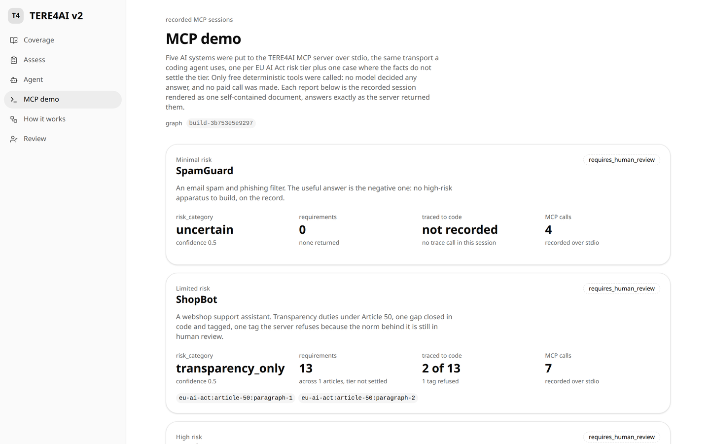

# TERE4AI

**The EU AI Act, as a knowledge graph your coding agent can call.**

TERE4AI is an open-source MCP server for teams building AI systems under
Regulation (EU) 2024/1689. A coding agent describes the system it is
building and gets back a deterministic risk classification, engineering
requirements traced to byte-exact legal text, judged alignments to the AI
HLEG Trustworthy AI principles, and requirement-to-code traceability.
Models propose; independent judges gate; a fixed rule ladder alone decides.

TERE4AI provides engineering and documentation support. It does not certify
EU AI Act compliance and does not replace legal review, conformity
assessment, or competent-authority interpretation.



## Who it is for

- **Developers and their coding agents** shipping a system that falls under
  the Act: wire the MCP server in, ask what the law requires, tag the code
  that implements each requirement.
- **Requirements engineers and compliance leads** who need every generated
  requirement to cite the exact legal span it came from, and who need the
  tool to say "unknown" when the facts are not there.
- **Researchers** studying evidence-gated generation over legal text: the
  judged graph, the provenance model and the evaluation harness are all here.

## Wire it into your agent

Two commands, then one config block. No database, no API keys: the graph
ships as versioned dumps in `data/graph_dumps/` and every free tool reads
them offline.

```bash
git clone https://github.com/josesiqueira/tere4ai.git && cd tere4ai
python3 -m venv .venv && .venv/bin/pip install -e .
```

```json
{
  "mcpServers": {
    "tere4ai": {
      "command": "/absolute/path/to/tere4ai/.venv/bin/python",
      "args": ["-m", "tere4ai.mcp_server.server"]
    }
  }
}
```

That block works as-is in Claude Code (`.mcp.json`), Claude Desktop, Cursor
and any other client that launches stdio MCP servers.

## What a call looks like

The agent describes the system as structured facts. Unknown is never
treated as false: a fact it does not state stays unknown, and the server
says so.

```json
{
  "features": {
    "description": "CredScore evaluates the creditworthiness of natural persons applying for consumer loans and recommends a decision a loan officer can override.",
    "domain": "banking",
    "autonomy": "advisory",
    "flags": {
      "creditworthiness_evaluation": true,
      "profiling_of_natural_persons": true,
      "essential_services_access": true
    }
  }
}
```

`classify_ai_system` answers (trimmed to the fields that matter; every
answer also carries the byte offsets of its source spans in the frozen
legal snapshot, the graph build id, and the notice above):

```json
{
  "answer": {
    "risk_category": "high_risk",
    "annex_iii_category": "eu-ai-act:annex-iii:point-5",
    "rationale": [
      "rule high_risk: flag essential_services_access matches Annex III category 'essential private and public services' (eu-ai-act:annex-iii:point-5), high-risk under Article 6(2)",
      "status lowered to requires_human_review: unknown prohibition-relevant flags could change the outcome to prohibited"
    ],
    "fria": { "applicability": "unknown", "basis_nodes": ["eu-ai-act:article-27:paragraph-1"] }
  },
  "status": "requires_human_review",
  "confidence": 0.5,
  "judge_verdict": "not_applicable_deterministic",
  "missing_facts": [
    "flags.subliminal_or_manipulative is unknown (prohibition-relevant, Article 5); absence is not treated as false",
    "..."
  ],
  "source_nodes": ["eu-ai-act:annex-iii:point-5", "eu-ai-act:article-6:paragraph-2"],
  "graph_version": "build-3b753e5e9297"
}
```

Supply the missing Article 5 facts and the same call settles to
`potentially_applicable`; `get_applicable_requirements` then returns the
judge-accepted norms for that tier, grouped by article, each with its
source span.

## The tools

All eleven run over stdio from the offline dumps. Eight are free and
deterministic; three make paid model calls and say so in their metadata.

| Tool | What it does | Cost |
|---|---|---|
| `classify_ai_system` | Risk tier plus Article 27 FRIA applicability from structured facts, by rule ladder | free |
| `get_applicable_requirements` | Judge-accepted norms for a classification, grouped by article, span-cited | free |
| `explain_requirement` | One norm: actor, modal, action, object, conditions; full source text; Article 3 definitions; accepted HLEG alignments | free |
| `trace_alignment` | Every alignment assertion for a norm or an HLEG requirement: relation, scores, judge verdict and rationale, model runs | free |
| `resolve_span` | A span id to its byte-exact text in the frozen snapshot | free |
| `source_trace` | A graph node to its frozen snapshot: file, sha256, span offsets, anchor, excerpt | free |
| `coverage_report` | Structural coverage of the Act and the judged layers, against the frozen source | free |
| `trace_implementation` | Which requirements the `@implements` tags in a codebase claim to cover, and which claims the server refuses | free |
| `evaluate_project_evidence` (+ `_batch`) | Judge whether pasted project evidence satisfies a requirement | paid |
| `generate_control_backlog` | Engineering controls for a set of requirements, judge-gated | paid |

Paid tools need `OPENAI_API_KEY` and `ANTHROPIC_API_KEY` in `.env` (see
`.env.example`). Without keys they return a `requires_human_review`
envelope that names the missing configuration; they never guess.

## What it is not

- Not a compliance certificate, a legal opinion or a conformity assessment.
- Not a model that "reads the law for you": classification is a fixed rule
  ladder over the real Article 5, Article 6 and Annex III nodes, and every
  model-produced norm or alignment passed an independent judge before it can
  be served. What the judges rejected or held for human review is published
  too (Review queue in the demo UI).
- Not a substitute for the facts: when a prohibition-relevant fact is
  unknown the status drops to `requires_human_review` and the answer names
  the fact.

## Documents

| File | Role |
|---|---|
| docs/architecture.md | Authoritative spec (layers, judges, milestones, traceability matrix) |
| docs/references.md | Reference register; all `@grounded_by` tags resolve here |
| docs/traceability.md | Generated by scripts/check_traceability.py, never hand-edited |
| AGENTS.md | Working rules for coding agents |
| USER.md | Domain guardrails and writing conventions |
| docs/DESIGN.md | Visual design system for the demo web UI |

## Layout

See docs/architecture.md Section 18. Key paths: `src/tere4ai/` (core),
`schema/json_schemas/` (machine-readable node and edge shapes),
`data/snapshots/` (frozen, checksummed legal sources), `data/graph_dumps/`
(versioned build artifacts), `web/` (thin read-only demo UI).

## Quick start (M1, structural mirror)

```bash
python3 -m venv .venv
.venv/bin/pip install -e ".[dev]"

# build the Layer 0+1 graph dump from the frozen snapshot
.venv/bin/python -m tere4ai.parse_legal_structure

# run tests (acceptance: 113 articles, 180 recitals, 13 annexes)
.venv/bin/python -m pytest

# traceability gate (also generates docs/traceability.md)
.venv/bin/python scripts/check_traceability.py

# optional: load into Neo4j (set NEO4J_PASSWORD in .env first)
docker compose up -d
```

Note on graph dumps: `data/graph_dumps/` holds the published build
artifacts, tracked in git under CC BY 4.0 (see License). `layer1.json`
rebuilds deterministically with the parse_legal_structure command above (no
cost). `norms_core.json` and `alignments_core.json` come from the judged
Layer 2/3 pipeline, which makes paid model calls (architecture.md Section
6). Neo4j exports (`*.dump`, `*.nt`) are gitignored.

Serving a published build is an explicit act:
`.venv/bin/python scripts/activate_build.py <chain_id>` verifies the files
its publication manifest names and writes `ACTIVE_MANIFEST.json`. The MCP
server loads per call and follows it at once; the HTTP facade loads once at
startup, so a restart is the only way the facade changes builds. A file that
drifts from the activated publication refuses service. Without a pointer
both serve the three fixed dump files as before.

```bash

# demo web UI (thin, read-only; docs/DESIGN.md)
.venv/bin/python scripts/export_ui_data.py
cd web && npm install && npm run build && npx next start
```

## Demo flow (M3)

The full demo flow (classify, requirements, evidence evaluation, backlog)
runs against the thin HTTP facade, which calls the same pure functions the
MCP server exposes. The UI never touches the database or model APIs
directly.

```bash
# 1. facade on port 8008 (loopback; CORS only for localhost:3111)
.venv/bin/uvicorn tere4ai.http_facade.app:app --port 8008

# 2. demo UI on port 3111, then open http://localhost:3111/assess
cd web && npm run build && npx next start -p 3111
```

/api/classify and /api/requirements are deterministic and free.
/api/evidence and /api/backlog perform PAID model calls (OpenAI generator
plus Anthropic runtime grounding judge; keys in .env, see .env.example) and
mark their responses with the X-TERE4AI-Paid-Call header.

## Build records, materialisation, publication and activation

Every build command (parse, extract, align, materialise, publish) writes an
execution record under `data/graph_dumps/build_records/` (DEC-16): what
ran, over which inputs (by digest), with which models and prompts, how far
it got (validated checkpoint keys against the expected total), how it
ended, and one outcome per gate. The facade serves them free on
`GET /api/builds` and `GET /api/builds/<record id or alias>`; the
dashboard's Build view reads only these routes. Every field says whether
it was recorded by the command, derived afterwards, or is unavailable.

Human decisions never edit a dump. Export the decisions file and its freeze
manifest from the dashboard, copy the manifest into `data/graph_dumps/`
(publication names its inputs by file under that directory), then:

    .venv/bin/python scripts/materialize_reference.py --pristine data/graph_dumps/norms_core.json \
        --decisions <decisions.json> --manifest <freeze-manifest.json>
    python -m tere4ai.align_hleg --norms data/graph_dumps/norms_core.reference.json
    .venv/bin/python scripts/publish_layer23.py --norms data/graph_dumps/norms_core.reference.json \
        --alignments data/graph_dumps/alignments_core.reference.json --manifest data/graph_dumps/<freeze-manifest.json>
    .venv/bin/python scripts/activate_build.py <chain id printed by publish>

Publish writes `build_chain_<id>.json` and `publications/<id>.json` only
after the post-load gates pass; `BUILD_CHAIN_CURRENT.txt` records the
latest publication and selects nothing; `NEO4J_TARGET.json` says whether
the database holds a validated build. Activation verifies the
publication's files and writes `ACTIVE_MANIFEST.json`; restart the facade
to serve it (the MCP server follows the pointer on its next call). Without
a pointer the facade serves the `*_core.json` files under their recomputed
chain, as before.

A run that stops (a usage limit, a crash) leaves its checkpoint; rerun
with `--resume` to continue it under a new run id that names the one it
resumes, after the inputs and configuration are checked; add
`--accept-legacy-checkpoint` for a checkpoint written before build records
existed. Starting the same output without `--resume` while a checkpoint
exists is refused. A published record is frozen: further work on the same
alias continues as a descendant record.

Tracked in git because they are publication evidence or inputs:
`build_chain_*.json`, `publications/`, `BUILD_CHAIN_CURRENT.txt`,
`*.reference.json`, `*.adjudicated.json`, the core dumps. Ignored because
they are per-checkout run state: `build_records/`, `*.checkpoint.jsonl`,
`*.writing.json`, `*.building.json`, `ACTIVE_MANIFEST.json`,
`NEO4J_TARGET.json`.

## Evaluation records (E1, E6)

Every measurement run writes one record under
`data/graph_dumps/evaluation_records/<record id>.json` with an immutable
copy of its outputs under `evaluation_records/<record id>/` (DEC-17).
The writers: `scripts/run_ablations.py` and `python -m tere4ai.eval.harness`
(E6 runs; `--no-record` to skip, `--dump-dir` to relocate; the runner
only: `--repeat-of <record id>` to name the run this one repeats), `scripts/variance_report.py`
(an E6 comparison naming the two runs it compared, by digest), and
`scripts/sample_judge_decisions.py` (E1 as three acts: the draw, which
refuses to overwrite any existing sheet without `--force` and binds the
sample to the activated publication or to the base build id; `--label
<decision id> <accept|reject> --by <name>` or `--label-file <csv> --by
<name>`, which record actor and time per item and refuse (exit code 2) a
sheet whose bytes are not the bytes the last recorded draw or label act of
its sample wrote, so a `--no-record` label act breaks the chain for the
next one; `--compute`, which refuses a
label without an actor or a time and writes an analysis record with the
false accept and false reject rates per judge kind and pooled, a rate with
an empty denominator being null, never 0.0, and every rate a sample
estimate). `--dump-dir` is where `layer1.json`, `norms_core.json` and
`evaluation_records/` live, for the runner, the harness and the sampler
alike. The runner refuses (exit code 2) to resume a checkpoint that no
record names unless `--resume-unrecorded` is given, the note then recorded.
The runner refuses (exit code 2) to append to or rewrite a file whose bytes
are a pinned July 2026 summary or checkpoint, `--no-record` or not. A draw over an active publication whose manifest lacks a role
refuses with a sentence and exit code 2 unless `--norms`, `--alignments`
or `--layer1` is given. The routes `GET /api/evaluations` (grouped by
build identity, newest first, records without a date last, the group with
no build identity last) and `GET /api/evaluations/<record id>` read the
records per request, the July 2026 measurements included as legacy
records synthesised from `eval/results/`,
`eval/gold/judge_label_sheet.json` and `docs/variance_study.md` (ids
derived from the file digests, dates only where an analysis file states
them, no build id for the ablation summaries because they carry none).
The July dates in the legacy records are pinned to the bytes of the July
files, never guessed. The contract with the dashboard is
`schema/json_schemas/evaluation_record.schema.json` and
`tests/fixtures/evaluation_records/`, regenerated by
`python -m tests.fixtures.evaluation_records.regenerate`.

A recording run of the runner writes a sidecar next to its checkpoint,
`<checkpoint>.record`, naming the record that owns the checkpoint. A resume
continues that record only when the store can read it and it names the same
checkpoint file; otherwise the runner refuses (exit code 2) and says why. A
checkpoint without a sidecar, a `--no-record` run's included, is resumed
only with `--resume-unrecorded`. The resuming record takes the sidecar over.
The sidecar is local state, git-ignored like the records: removing it makes
the checkpoint one no record names.

## Status

M1 to M3 implemented, M4 harness ready (see docs/architecture.md Section 14
and docs/traceability.md, which is generated from code tags):

- M1: deterministic Layer 1 mirror of the full Act (113 articles, 180
  recitals, 13 annexes, 467 points, 217 annex items), version pin (base Act
  in force, Digital Omnibus as an amending source), crossrefs, coverage and
  trace tools, traceability gate.
- M2: judged Layer 2/3 over the high-risk core. 434 extracted norms (339
  judge-accepted), 620 reified HLEG alignment assertions (475 accepted),
  independent judge family (OpenAI generator, Anthropic judges), all in
  Neo4j with per-edge provenance and full audit logs.
- M3: runtime tools. Deterministic classify_ai_system (rules over real
  Article 5 and Annex III nodes, never an LLM) and
  get_applicable_requirements; judged evaluate_project_evidence and
  generate_control_backlog gated by the runtime grounding judge; the
  eleven tools on the MCP server; HTTP facade plus the /assess demo flow,
  the recorded-session /mcp-demo page and the agent replay.
- M4: evaluation harness with the five-condition ablation ladder, Section 12
  metrics, a 10-item seed gold set, and the located REF-15 benchmark. Live
  ablation runs and the full 60-80 item gold set are pending research work
  (cost-gated; see eval/README.md).

## Development

Optional, and only useful to the maintainer: this repository ships a pre-commit
hook that refuses a change to a DEC entry or the reference register unless the
maintainer's private research log records why the direction changed. Activate it
with:

    git config core.hooksPath hooks

Git cannot version that setting, so it is one command per clone. The hook itself
is versioned under `hooks/`. It detects that the private repository is absent and
does nothing, so it never blocks an outside contributor.

## License

Decided 2026-07-23 (OPEN-LICENSE resolved):

- Code (server, pipeline, web UI): AGPL-3.0-or-later, full text in
  [LICENSE](LICENSE).
- Graph metadata (the published dumps' structure, normative-statement
  metadata, alignments, provenance): CC BY 4.0, full text in
  [data/graph_dumps/LICENSE](data/graph_dumps/LICENSE). Attribution: Jose
  Antonio Siqueira de Cerqueira, TERE4AI.
- EU legal texts quoted inside the graph and dumps remain (c) European Union,
  reused under the EU legal-reuse framework (Commission Decision 2011/833/EU);
  no ownership is claimed over them and quotes are served byte-exact.
- ALTAI content is not redistributed pending its license check (task C2).
