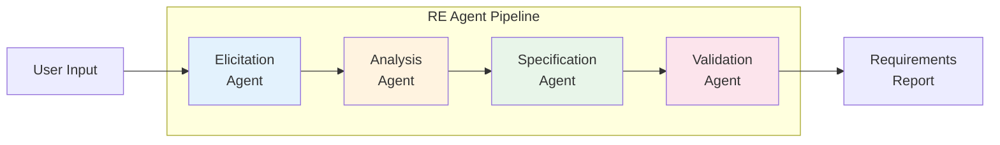
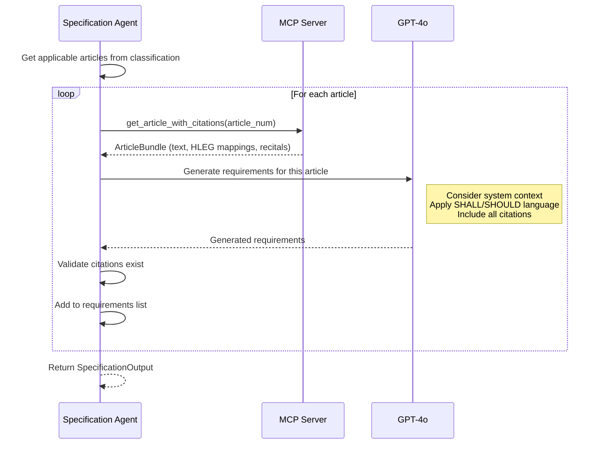
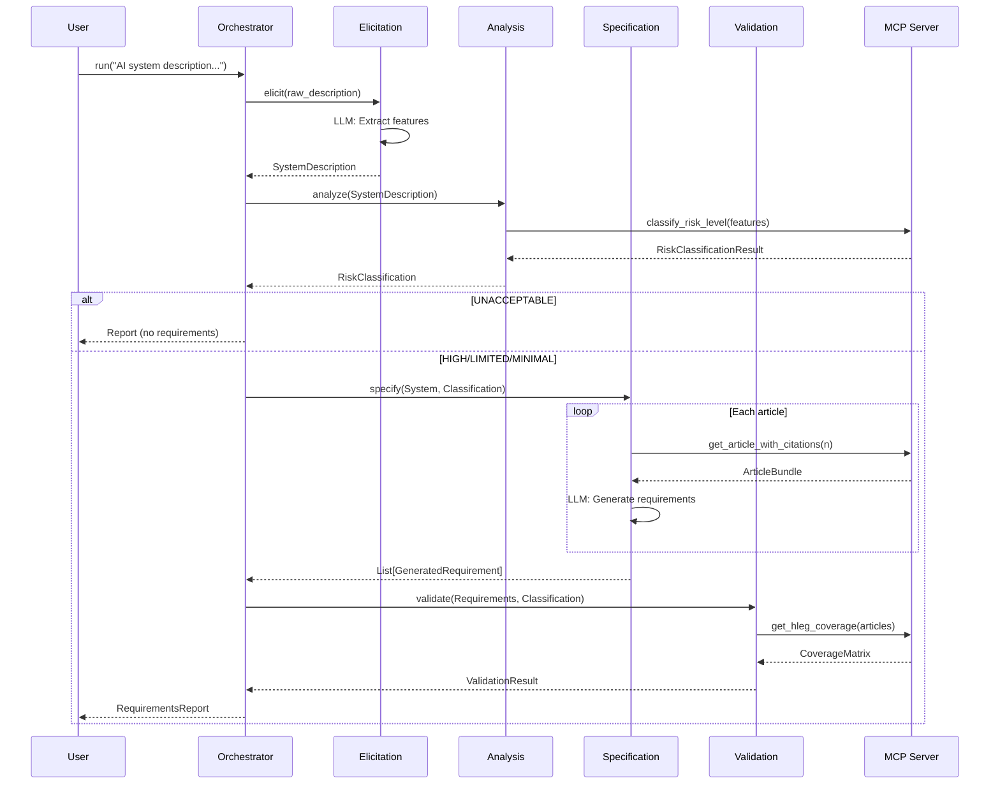

# TERE4AI Agent Design Documentation

**Version:** 0.1.0 (MVP)
**Framework:** Pydantic-AI + OpenAI GPT-4o

---

## Overview

TERE4AI implements a **multi-agent pipeline** aligned with formal Requirements Engineering (RE) methodology. Each agent corresponds to a distinct RE phase, ensuring methodological rigor suitable for academic publication.



---

## Base Agent Architecture

All agents inherit from `BaseAgent`, which provides:

```python
class BaseAgent(ABC, Generic[InputT, OutputT]):
    """
    Base class for TERE4AI Requirements Engineering agents.

    Provides:
      - MCP tool access via self.mcp
      - Logging and tracing via self.trace
      - Configuration via self.config
    """

    # Configuration
    config: AgentConfig

    # MCP tool client
    mcp: MCPToolClient

    # Abstract properties
    @property
    def name(self) -> str: ...          # Agent identifier
    @property
    def phase(self) -> str: ...         # RE phase name

    # Abstract methods
    async def run(self, input: InputT) -> OutputT: ...
    def _get_system_prompt(self) -> str: ...

    # Tracing methods
    def _start_trace(self, input_summary: str) -> AgentTrace: ...
    def _complete_trace(self, output_summary: str) -> AgentTrace: ...
```

### Agent Configuration

```python
@dataclass
class AgentConfig:
    model: str = "gpt-4o"           # LLM model
    temperature: float = 0.1        # Low for deterministic output
    max_tokens: int = 4096
    max_retries: int = 3
    retry_delay: float = 1.0
    log_level: str = "INFO"
    trace_enabled: bool = True

    @classmethod
    def from_env(cls) -> AgentConfig:
        """Load from environment variables."""
```

### Agent Tracing

Each agent execution produces an `AgentTrace` for academic analysis:

```python
@dataclass
class AgentTrace:
    agent_name: str
    phase: str
    started_at: datetime
    completed_at: datetime
    input_summary: str
    output_summary: str
    mcp_calls: list[dict]          # All MCP tool calls
    llm_calls: list[dict]          # All LLM interactions
    error: str | None

    def duration_ms(self) -> float: ...
```

---

## Agent 1: Elicitation Agent

**RE Phase:** Requirements Elicitation
**File:** `agents/elicitation/agent.py`

### Purpose

Extract structured system characteristics from natural language user input. The agent acts like an analyst interviewing a stakeholder, identifying all risk-relevant features.

### Input/Output

```python
class ElicitationInput(BaseModel):
    raw_description: str              # User's natural language input
    additional_context: str | None    # Optional clarifications

# Output type alias
ElicitationOutput = SystemDescription  # Structured system model
```

### Extraction Strategy

| Principle | Description |
|-----------|-------------|
| **Conservative** | Flag risk indicators if uncertain (false positive > false negative) |
| **Grounded** | Only extract what is stated or clearly implied |
| **Complete** | Capture ALL risk-relevant characteristics |
| **Traceable** | Document ambiguities and assumptions |

### System Prompt (Key Excerpts)

```
You are the Elicitation Agent for TERE4AI...

EXTRACTION PRINCIPLES:

1. CONSERVATIVE FLAGGING
   - If you're uncertain whether a risk flag applies, FLAG IT as true
   - False positives are acceptable; false negatives are not

2. GROUNDED EXTRACTION
   - Only extract what is stated or clearly implied
   - Document assumptions in the 'assumptions' field

3. COMPLETENESS
   - Extract ALL risk-relevant characteristics
   - Consider both explicit statements and implications

DOMAIN CLASSIFICATION:
healthcare, education, employment, finance, law_enforcement, justice,
migration, critical_infrastructure, biometrics, transportation, ...

DATA CATEGORIES:
biometric, health, financial, behavioral, location, communication, ...

DECISION TYPES:
access_denial, resource_allocation, ranking, assessment, prediction, ...
```

### Output: SystemDescription

```python
class SystemDescription(BaseModel):
    # From user input
    raw_description: str

    # Extracted by agent
    name: str | None
    domain: SystemDomain
    purpose: str | None

    # Risk-relevant characteristics
    intended_users: list[str]
    affected_persons: list[str]
    data_types: list[DataCategory]
    decision_types: list[DecisionType]
    autonomy_level: AutonomyLevel
    deployment_context: DeploymentContext

    # Risk flags
    affects_fundamental_rights: bool
    safety_critical: bool
    biometric_processing: bool
    real_time_biometric: bool
    law_enforcement_use: bool
    critical_infrastructure: bool
    vulnerable_groups: bool
    emotion_recognition: bool
    social_scoring: bool
    subliminal_techniques: bool

    # Extraction metadata
    extraction_confidence: float
    ambiguities: list[str]
    assumptions: list[str]
```

---

## Agent 2: Analysis Agent

**RE Phase:** Requirements Analysis
**File:** `agents/analysis/agent.py`

### Purpose

Classify the risk level of the AI system based on EU AI Act criteria and determine which legal requirements apply.

### Input/Output

```python
# Input/Output type aliases
AnalysisInput = SystemDescription

AnalysisOutput = RiskClassification
```

### Classification Logic

```mermaid
flowchart TD
    START[SystemDescription] --> A5{Article 5<br/>Prohibited?}

    A5 -->|Yes| UNACCEPTABLE[UNACCEPTABLE]
    A5 -->|No| A3{Annex III<br/>High-Risk?}

    A3 -->|Yes| A63{Article 6(3)<br/>Exception?}
    A3 -->|No| A50{Article 50<br/>Transparency?}

    A63 -->|Yes| LIMITED1[LIMITED]
    A63 -->|No| HIGH[HIGH]

    A50 -->|Yes| LIMITED2[LIMITED]
    A50 -->|No| MINIMAL[MINIMAL]
```

### MCP Tool Usage

The Analysis Agent primarily uses `classify_risk_level`:

```python
async def analyze(self, system: SystemDescription) -> RiskClassification:
    # Convert system description to features dict
    features = system.to_features()

    # Call MCP tool for classification
    result = self.mcp.classify_risk_level(features)

    # Build RiskClassification with citations
    return RiskClassification(
        level=RiskLevel(result["risk_level"]),
        legal_basis=self._build_citation_bundle(result),
        annex_iii_category=result.get("annex_category"),
        applicable_articles=self._get_applicable_articles(result),
        article_6_exception_checked=True,
        hleg_implications=self._build_hleg_citations(result),
        reasoning=result["reasoning"]
    )
```

### Output: RiskClassification

```python
class RiskClassification(BaseModel):
    level: RiskLevel                      # UNACCEPTABLE/HIGH/LIMITED/MINIMAL
    legal_basis: CitationBundle           # Primary + supporting citations
    prohibition_article: str | None       # For UNACCEPTABLE
    annex_iii_category: str | None        # For HIGH
    applicable_articles: list[str]        # e.g., ["8", "9", ..., "27"]
    article_6_exception_checked: bool
    hleg_implications: list[Citation]
    reasoning: str
```

---

## Agent 3: Specification Agent

**RE Phase:** Requirements Specification
**File:** `agents/specification/agent.py`

### Purpose

Generate formal requirements anchored to specific EU AI Act articles and HLEG principles. Each requirement includes full citations for traceability.

### Input/Output

```python
class SpecificationInput(BaseModel):
    system_description: SystemDescription
    risk_classification: RiskClassification

class SpecificationOutput(BaseModel):
    requirements: list[GeneratedRequirement]
    articles_processed: list[int]
    generation_notes: list[str]
```

### Requirement Generation Process



### Requirement Format

```python
class GeneratedRequirement(BaseModel):
    id: str                              # REQ-001, REQ-002, ...
    title: str                           # Short title
    statement: str                       # Full requirement (SHALL...)

    category: RequirementCategory
    priority: RequirementPriority

    # Legal anchoring
    eu_ai_act_citations: list[Citation]
    hleg_citations: list[Citation]
    supporting_recitals: list[int]

    # Traceability
    rationale: str
    verification_criteria: list[str]
    derived_from_articles: list[int]
    addresses_hleg_principles: list[str]
    addresses_hleg_subtopics: list[str]
```

### Categories

| Category | Articles | Description |
|----------|----------|-------------|
| `risk_management` | 9 | Risk management system |
| `data_governance` | 10 | Data quality and governance |
| `documentation` | 11 | Technical documentation |
| `record_keeping` | 12 | Automatic logging |
| `transparency` | 13 | Transparency and information |
| `human_oversight` | 14 | Human oversight measures |
| `accuracy_robustness` | 15 | Accuracy, robustness, cybersecurity |
| `provider_obligations` | 16-22 | Provider duties |
| `deployer_obligations` | 26-27 | Deployer duties |

---

## Agent 4: Validation Agent

**RE Phase:** Requirements Validation
**File:** `agents/validation/agent.py`

### Purpose

Ensure the generated requirements are complete, consistent, and traceable. Check coverage of all applicable articles and HLEG principles.

### Input/Output

```python
class ValidationInput(BaseModel):
    requirements: list[GeneratedRequirement]
    risk_classification: RiskClassification
    applicable_articles: list[int]

class ValidationOutput = ValidationResult
```

### Validation Checks

| Check | Description | Target |
|-------|-------------|--------|
| **Article Coverage** | All applicable articles have requirements | ≥ 80% |
| **HLEG Coverage** | All 7 principles addressed (high-risk) | ≥ 80% |
| **Subtopic Coverage** | HLEG subtopics covered | Tracked |
| **Citation Validity** | All citations point to existing sources | 100% |
| **Conflict Detection** | No contradictory requirements | 0 conflicts |

### MCP Tool Usage

```python
async def validate(self, input: ValidationInput) -> ValidationResult:
    # Get HLEG coverage from knowledge graph
    coverage = self.mcp.get_hleg_coverage(input.applicable_articles)

    # Check article coverage
    covered_articles = set()
    for req in input.requirements:
        covered_articles.update(req.derived_from_articles)

    expected_articles = set(input.applicable_articles)
    article_coverage = len(covered_articles) / len(expected_articles)

    # Check for conflicts
    conflicts = self._detect_conflicts(input.requirements)

    # Validate citations
    invalid_citations = self._validate_citations(input.requirements)

    return ValidationResult(
        is_complete=article_coverage >= 0.8,
        is_consistent=len(conflicts) == 0,
        is_traceable=len(invalid_citations) == 0,
        article_coverage=article_coverage,
        hleg_coverage=coverage["coverage_percentage"] / 100,
        missing_articles=list(expected_articles - covered_articles),
        uncovered_hleg_principles=coverage["uncovered_principles"],
        conflicts=conflicts,
        invalid_citations=invalid_citations
    )
```

### Output: ValidationResult

```python
class ValidationResult(BaseModel):
    is_complete: bool                    # Article coverage ≥ 80%
    is_consistent: bool                  # No conflicts
    is_traceable: bool                   # All citations valid

    article_coverage: float              # 0.0-1.0
    hleg_coverage: float                 # 0.0-1.0

    missing_articles: list[int]
    uncovered_hleg_principles: list[str]
    uncovered_hleg_subtopics: list[str]

    conflicts: list[ConflictDetail]
    invalid_citations: list[InvalidCitationDetail]
```

---

## Orchestrator

**File:** `agents/orchestrator.py`

### Purpose

Coordinate the sequential execution of all four agents and produce the final `RequirementsReport`.

### Pipeline Flow

```python
async def run(
    self,
    raw_description: str,
    additional_context: str | None = None,
    progress_callback: Callable[[str, str], None] | None = None
) -> PipelineResult:
    """
    Run the full RE pipeline.

    Phases:
    1. Elicitation → SystemDescription
    2. Analysis → RiskClassification
    3. Specification → List[GeneratedRequirement] (if not prohibited)
    4. Validation → ValidationResult (if not prohibited)
    """
```

### Early Termination

For **UNACCEPTABLE** (prohibited) systems, the pipeline stops after Analysis:

```python
if risk_classification.level == RiskLevel.UNACCEPTABLE:
    return RequirementsReport(
        system_description=system_description,
        risk_classification=risk_classification,
        requirements=[],  # Empty!
        validation=None,
        ...
    )
```

### Progress Callbacks

The orchestrator supports progress callbacks for UI updates:

```python
async def notify_progress(phase: str, message: str):
    if progress_callback:
        await progress_callback(phase, message)

await notify_progress("elicitation", "Extracting system characteristics...")
await notify_progress("analysis", "Classifying risk level...")
await notify_progress("specification", "Generating requirements...")
await notify_progress("validation", "Validating completeness...")
await notify_progress("complete", "Finalizing report...")
```

### Pipeline Result

```python
@dataclass
class PipelineResult:
    report: RequirementsReport
    traces: list[AgentTrace]           # All agent traces
    total_duration_ms: float
    success: bool
    error: str | None
```

---

## Agent Interaction Diagram



---

## Error Handling

Each agent implements retry logic with exponential backoff:

```python
async def run_with_retry(self, input_data: InputT) -> OutputT:
    for attempt in range(self.config.max_retries):
        try:
            return await self.run(input_data)
        except Exception as e:
            if attempt == self.config.max_retries - 1:
                raise
            await asyncio.sleep(self.config.retry_delay * (2 ** attempt))
```

The orchestrator catches exceptions and produces an error report:

```python
except Exception as e:
    return PipelineResult(
        report=RequirementsReport(..., processing_errors=[str(e)]),
        success=False,
        error=str(e)
    )
```

---

*Document created: January 2026*
*Project: TERE4AI - Trustworthy Ethical Requirements Engineering for AI*
