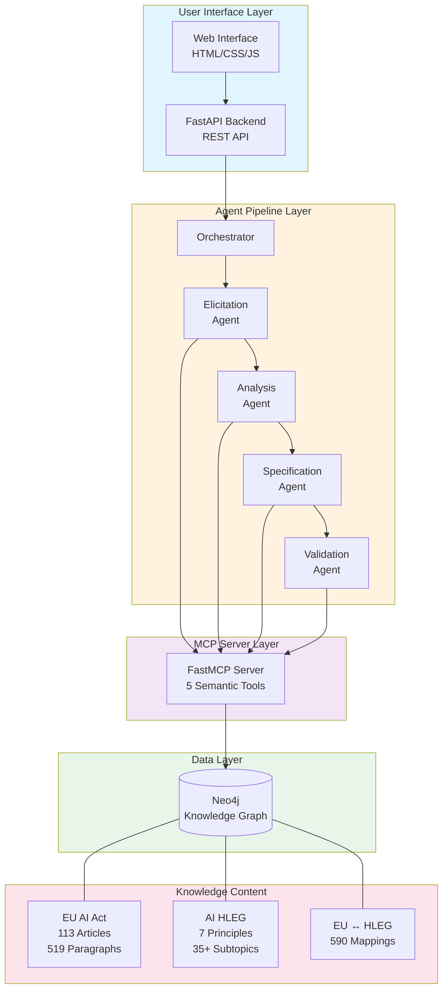
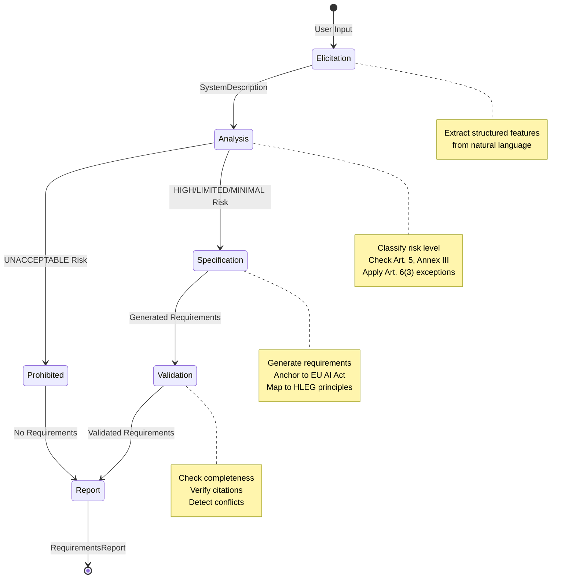
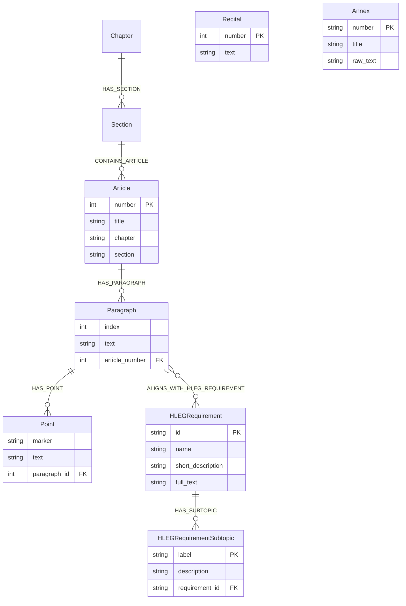
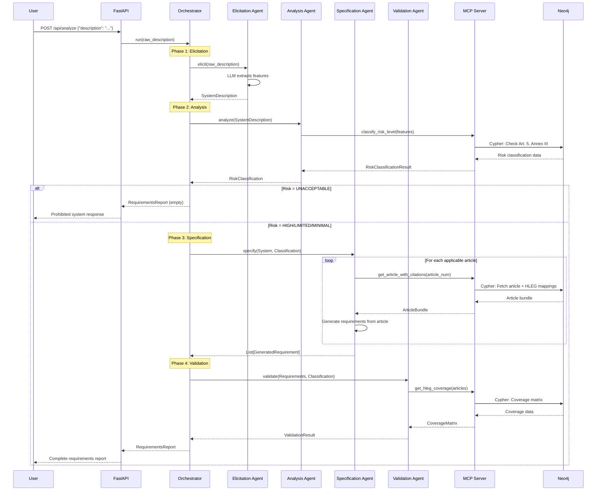

# TERE4AI System Architecture

**Version:** 0.1.0 (MVP)
**Target:** REFSQ 2026 Short Paper
**Last Updated:** January 2026

---

## Executive Summary

TERE4AI (Trustworthy Ethical Requirements Engineering for AI) is a tool that generates ethically-anchored software requirements grounded in the EU AI Act and the AI HLEG Trustworthy AI Guidelines. The system takes a natural language description of an AI system as input and produces a comprehensive requirements report with full traceability to legal sources.

---

## System Architecture Diagram



---

## Component Overview

### 1. User Interface Layer

| Component | Technology | Purpose |
|-----------|------------|---------|
| Web Interface | HTML/CSS/JavaScript | Interactive form for system descriptions |
| FastAPI Backend | FastAPI + Uvicorn | REST API, job management, static files |

**Key Features:**
- Real-time progress bar showing RE phase transitions
- Example system descriptions dropdown
- Risk classification color-coded banners
- Expandable requirements cards with citations
- Export functionality (JSON, Markdown)

### 2. Agent Pipeline Layer

The core of TERE4AI implements a **formal Requirements Engineering methodology** through four specialized agents:

| Agent | RE Phase | Input | Output |
|-------|----------|-------|--------|
| **Elicitation** | Requirements Elicitation | Raw text description | `SystemDescription` |
| **Analysis** | Requirements Analysis | `SystemDescription` | `RiskClassification` |
| **Specification** | Requirements Specification | Classification + System | `List[GeneratedRequirement]` |
| **Validation** | Requirements Validation | Requirements + Classification | `ValidationResult` |

**Orchestrator** coordinates the sequential execution of all agents, handles early termination for prohibited systems, and produces the final `RequirementsReport`.

### 3. MCP Server Layer

The Model Context Protocol (MCP) server acts as a **semantic bridge** between agents and the knowledge graph:

```
Agent → MCP Tool Call → Cypher Query → Neo4j → Structured Response → Agent
```

**Benefits:**
- Agents call semantic operations, not raw database queries
- Validated, tested queries with proper error handling
- Reusable tool library across all agents
- Decoupled agent logic from database schema

### 4. Data Layer

**Neo4j Knowledge Graph** stores the complete EU AI Act and HLEG documents with semantic mappings.

**Current Content:**
- 113 EU AI Act articles with 519 paragraphs
- 7 HLEG principles with 35+ subtopics
- 590 EU ↔ HLEG semantic mappings

---

## RE Phase Workflow Diagram



---

## Risk Classification Decision Tree

```mermaid
flowchart TD
    START[System Description] --> CHECK_PROHIBITED{Article 5<br/>Prohibited Practice?}

    CHECK_PROHIBITED -->|Yes| UNACCEPTABLE[UNACCEPTABLE<br/>No Requirements]
    CHECK_PROHIBITED -->|No| CHECK_ANNEX{Annex III<br/>High-Risk Category?}

    CHECK_ANNEX -->|Yes| CHECK_EXCEPTION{Article 6(3)<br/>Exception Applies?}
    CHECK_ANNEX -->|No| CHECK_TRANSPARENCY{Article 50<br/>Transparency Required?}

    CHECK_EXCEPTION -->|Yes| LIMITED_EX[LIMITED<br/>Transparency Only]
    CHECK_EXCEPTION -->|No| HIGH[HIGH-RISK<br/>Full Requirements<br/>Articles 8-27]

    CHECK_TRANSPARENCY -->|Yes| LIMITED[LIMITED<br/>Transparency Only]
    CHECK_TRANSPARENCY -->|No| MINIMAL[MINIMAL<br/>General AI Principles]

    style UNACCEPTABLE fill:#ef5350,color:#fff
    style HIGH fill:#ff9800,color:#fff
    style LIMITED fill:#ffeb3b,color:#000
    style LIMITED_EX fill:#ffeb3b,color:#000
    style MINIMAL fill:#4caf50,color:#fff
```

**Prohibited Practices (Article 5):**
- Social scoring by public authorities
- Real-time biometric ID in public spaces (law enforcement)
- Subliminal manipulation techniques
- Exploitation of vulnerabilities
- Emotion recognition in workplace/education
- Biometric categorization on sensitive attributes
- Predictive policing based on profiling
- Scraping facial images from internet/CCTV

**High-Risk Categories (Annex III):**
1. Biometrics (remote identification)
2. Critical Infrastructure (energy, water, transport, digital)
3. Education and Vocational Training
4. Employment and Worker Management
5. Essential Services (healthcare, public benefits)
6. Law Enforcement
7. Migration and Border Control
8. Justice and Democratic Processes

---

## Knowledge Graph Schema



**Node Types:**
| Node | Count | Description |
|------|-------|-------------|
| Article | 113 | EU AI Act articles |
| Paragraph | 519 | Article paragraphs |
| Point | ~200 | Sub-points within paragraphs |
| Recital | 180 | EU AI Act recitals |
| Annex | 13 | EU AI Act annexes |
| HLEGRequirement | 7 | HLEG main principles |
| HLEGRequirementSubtopic | 35+ | HLEG subtopics |

**Relationship Types:**
| Relationship | Description |
|--------------|-------------|
| HAS_PARAGRAPH | Article → Paragraph |
| HAS_POINT | Paragraph → Point |
| ALIGNS_WITH_HLEG_REQUIREMENT | Paragraph → HLEGRequirement |
| HAS_SUBTOPIC | HLEGRequirement → HLEGRequirementSubtopic |

---

## Data Flow Diagram



---

## Technology Stack

| Layer | Technology | Version | Purpose |
|-------|------------|---------|---------|
| **Frontend** | HTML/CSS/JavaScript | - | Web interface |
| **Backend** | FastAPI | 0.109+ | REST API |
| **Server** | Uvicorn | 0.27+ | ASGI server |
| **Agents** | Pydantic-AI | 0.1+ | Structured LLM output |
| **LLM** | OpenAI GPT-4o | - | Language understanding |
| **MCP** | FastMCP | 0.1+ | Tool protocol |
| **Database** | Neo4j | 5.0+ | Knowledge graph |
| **Models** | Pydantic | 2.0+ | Data validation |
| **HTTP** | HTTPX | 0.26+ | Async HTTP client |

---

## Directory Structure

```
tere4ai/
├── agents/                  # RE Phase agents
│   ├── base.py             # Base agent class, MCPToolClient
│   ├── orchestrator.py     # Pipeline orchestration
│   ├── elicitation/        # Phase 1: Extract features
│   │   └── agent.py
│   ├── analysis/           # Phase 2: Risk classification
│   │   └── agent.py
│   ├── specification/      # Phase 3: Generate requirements
│   │   └── agent.py
│   └── validation/         # Phase 4: Validate completeness
│       └── agent.py
├── mcp_server/             # MCP Server (5 tools)
│   ├── server.py           # Tool implementations
│   └── tools/              # (Reserved for future modular tools)
├── api/                    # FastAPI Backend
│   ├── main.py             # Application entry point
│   ├── job_manager.py      # Async job processing
│   ├── models.py           # Request/response models
│   └── static/             # Frontend files
│       ├── index.html
│       ├── app.js
│       └── styles.css
├── shared/                 # Shared Pydantic models
│   └── models/
│       ├── citations.py    # Citation, CitationBundle
│       ├── risk.py         # RiskLevel, RiskClassification
│       ├── system_description.py
│       ├── requirements.py # GeneratedRequirement
│       └── report.py       # RequirementsReport
├── ingestion/              # Data preprocessing
│   ├── structural/         # Regex extraction
│   ├── semantic/           # LLM-based mapping
│   └── db/                 # Neo4j ingestion
├── data/                   # Source documents
│   ├── eu_ai_act.txt
│   └── ai_hleg.txt
├── docs/                   # Documentation
└── tests/                  # Test suite
```

---

## Performance Characteristics

| Metric | Target | Notes |
|--------|--------|-------|
| End-to-end latency | < 2 minutes | Full pipeline for high-risk system |
| Elicitation phase | ~5-10 seconds | LLM feature extraction |
| Analysis phase | ~2-5 seconds | Risk classification |
| Specification phase | ~30-60 seconds | Requirement generation (bottleneck) |
| Validation phase | ~5-10 seconds | Coverage checking |
| UI responsiveness | Real-time | Progress bar updates during processing |

---

## Security Considerations

1. **API Keys**: OpenAI and Neo4j credentials stored in environment variables
2. **Input Validation**: Pydantic models validate all inputs
3. **Database Access**: Read-only queries for risk classification and article retrieval
4. **CORS**: Configured for frontend-backend communication

---

## Future Enhancements

1. **GPAI Classification**: Support for General-Purpose AI models
2. **Multi-domain Systems**: Handle systems spanning multiple risk categories
3. **Iterative Refinement**: User feedback loop for requirement improvement
4. **Additional Exports**: PDF, CSV, BibTeX formats
5. **Caching**: LLM response caching for reproducibility
6. **Evaluation Framework**: Gold standard dataset for accuracy measurement

---

*Document created: January 2026*
*Project: TERE4AI - Trustworthy Ethical Requirements Engineering for AI*
*Target venue: REFSQ 2026 (Short Paper)*
