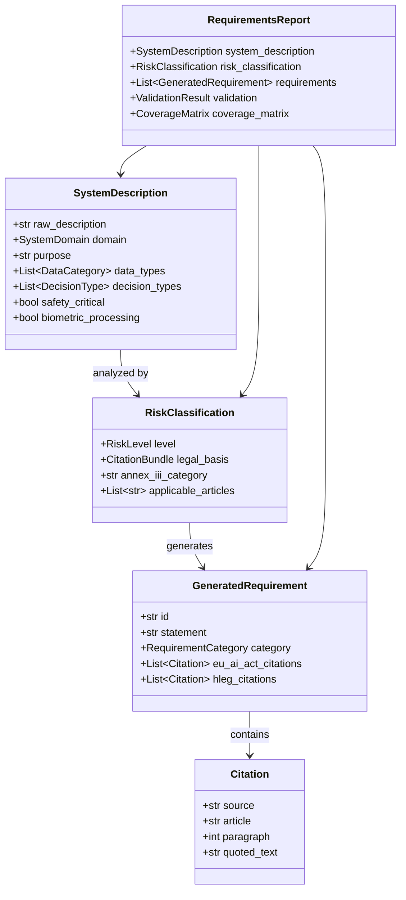
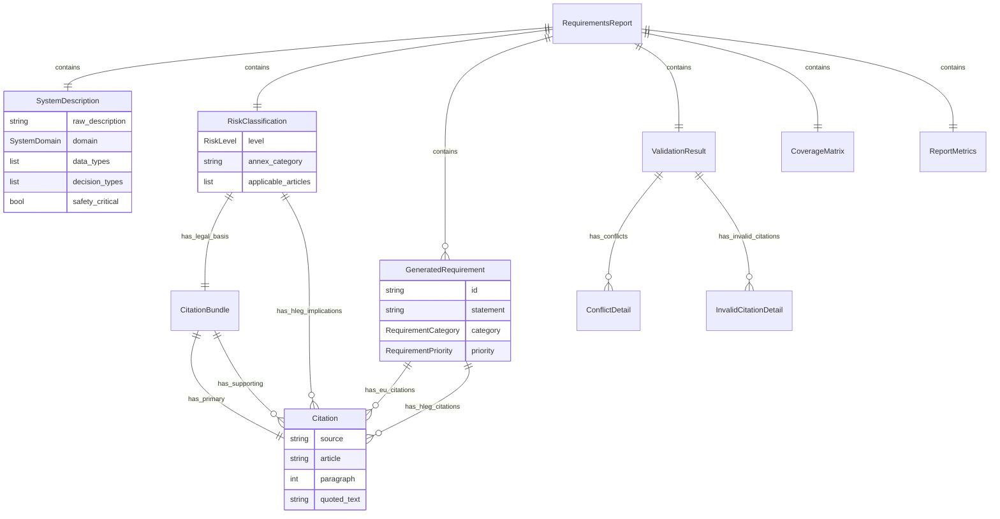

# TERE4AI Data Model Documentation

**Version:** 0.1.0 (MVP)
**Framework:** Pydantic 2.0+
**Location:** `shared/models/`

---

## Overview

TERE4AI uses **Pydantic models** throughout the system for type safety, validation, and serialization. Models are organized by purpose across multiple files.



---

## Model Files

| File | Purpose | Key Classes |
|------|---------|-------------|
| `citations.py` | Traceability | `Citation`, `CitationBundle` |
| `risk.py` | Risk classification | `RiskLevel`, `RiskClassification` |
| `system_description.py` | User input | `SystemDescription`, enums |
| `requirements.py` | Generated output | `GeneratedRequirement`, `ValidationResult` |
| `report.py` | Final report | `RequirementsReport`, `CoverageMatrix` |
| `legal.py` | EU AI Act structure | `Article`, `Paragraph`, `Recital` |
| `hleg.py` | HLEG structure | `HlegRequirement`, `HlegRequirementSubtopic` |
| `mappings.py` | EU↔HLEG links | `EuToHlegMapping` |

---

## Core Models

### 1. Citation (`citations.py`)

The **fundamental unit of traceability** in TERE4AI. Every requirement must cite its legal and ethical sources.

```python
class Citation(BaseModel):
    """A traceable reference to legal/ethical source."""

    # Source document
    source: Literal["EU_AI_ACT", "AI_HLEG"]
    document_id: str = "eu_ai_act_2024"

    # EU AI Act location (structural)
    chapter: str | None = None          # e.g., "III"
    section: str | None = None          # e.g., "2"
    article: str | None = None          # e.g., "9"
    paragraph: int | None = None        # e.g., 1
    point: str | None = None            # e.g., "a"
    recital: int | None = None          # e.g., 47
    annex: str | None = None            # e.g., "III"

    # HLEG location
    requirement_id: str | None = None   # e.g., "technical_robustness_and_safety"
    subtopic_id: str | None = None      # e.g., "resilience_to_attack"

    # Content
    reference_text: str                  # "Article 9(1)" - formatted reference
    quoted_text: str                     # Actual text from source
    relevance_score: float | None = None # 0.0-1.0 for HLEG mappings

    def format_reference(self) -> str:
        """Format as human-readable reference string."""
```

**Example EU AI Act Citation:**
```python
Citation(
    source="EU_AI_ACT",
    chapter="III",
    section="2",
    article="9",
    paragraph=1,
    reference_text="Article 9(1)",
    quoted_text="A risk management system shall be established, implemented, documented and maintained..."
)
```

**Example HLEG Citation:**
```python
Citation(
    source="AI_HLEG",
    requirement_id="technical_robustness_and_safety",
    subtopic_id="resilience_to_attack",
    reference_text="Technical Robustness and Safety - Resilience to attack",
    quoted_text="AI systems should be resilient against attempts by unauthorized third parties...",
    relevance_score=0.95
)
```

### CitationBundle

Groups related citations together:

```python
class CitationBundle(BaseModel):
    """Collection of citations supporting a claim."""

    primary: Citation                   # Main legal basis
    supporting: list[Citation] = []     # Recitals, HLEG, etc.
    rationale: str = ""                 # Why these citations apply
```

### CANONICAL_HLEG_IDS

Standard identifiers for the 7 HLEG principles:

```python
CANONICAL_HLEG_IDS = {
    "human_agency_and_oversight",
    "technical_robustness_and_safety",
    "privacy_and_data_governance",
    "transparency",
    "diversity_non_discrimination_and_fairness",
    "societal_and_environmental_wellbeing",
    "accountability",
}
```

---

### 2. Risk Classification (`risk.py`)

```python
class RiskLevel(str, Enum):
    """EU AI Act risk levels."""
    UNACCEPTABLE = "unacceptable"   # Article 5 - Prohibited
    HIGH = "high"                    # Article 6 + Annex III
    LIMITED = "limited"              # Article 50 - Transparency
    MINIMAL = "minimal"              # No specific obligations
```

```python
class RiskClassification(BaseModel):
    """Result of risk analysis phase."""

    level: RiskLevel
    legal_basis: CitationBundle          # Why this classification

    # For UNACCEPTABLE
    prohibition_article: str | None = None
    violated_hleg_principles: list[str] = []

    # For HIGH
    annex_iii_category: str | None = None
    applicable_articles: list[str] = []   # ["8", "9", ..., "27"]
    article_6_exception_checked: bool = False

    # For LIMITED
    transparency_articles: list[str] = []

    # HLEG alignment
    hleg_implications: list[Citation] = []

    # Explanation
    reasoning: str = ""
```

**Annex III Categories:**

```python
class AnnexIIICategory(str, Enum):
    BIOMETRICS = "1"
    CRITICAL_INFRASTRUCTURE = "2"
    EDUCATION = "3"
    EMPLOYMENT = "4"
    ESSENTIAL_SERVICES = "5"
    LAW_ENFORCEMENT = "6"
    MIGRATION = "7"
    JUSTICE = "8"
```

**Prohibited Practices:**

```python
class ProhibitedPractice(str, Enum):
    SOCIAL_SCORING = "5_1_c"
    SUBLIMINAL_MANIPULATION = "5_1_a"
    EXPLOITATION_VULNERABILITY = "5_1_b"
    BIOMETRIC_CATEGORIZATION = "5_1_g"
    REAL_TIME_BIOMETRIC_LAW_ENFORCEMENT = "5_1_h"
    EMOTION_RECOGNITION_WORKPLACE = "5_1_f"
    PREDICTIVE_POLICING = "5_1_d"
    FACIAL_IMAGE_SCRAPING = "5_1_e"
    INTIMATE_IMAGE_GENERATION = "5_1_c_intimate"
```

---

### 3. System Description (`system_description.py`)

The structured representation of user input, extracted by the Elicitation Agent.

```python
class SystemDomain(str, Enum):
    """AI system application domains."""
    HEALTHCARE = "healthcare"
    EDUCATION = "education"
    EMPLOYMENT = "employment"
    FINANCE = "finance"
    LAW_ENFORCEMENT = "law_enforcement"
    JUSTICE = "justice"
    MIGRATION = "migration"
    CRITICAL_INFRASTRUCTURE = "critical_infrastructure"
    BIOMETRICS = "biometrics"
    TRANSPORTATION = "transportation"
    SOCIAL_MEDIA = "social_media"
    CONTENT_GENERATION = "content_generation"
    CONSUMER_PRODUCTS = "consumer_products"
    SCIENTIFIC_RESEARCH = "scientific_research"
    MILITARY_DEFENSE = "military_defense"
    GENERAL = "general"
```

```python
class DataCategory(str, Enum):
    """Types of data processed by the AI system."""
    BIOMETRIC = "biometric"
    HEALTH = "health"
    FINANCIAL = "financial"
    BEHAVIORAL = "behavioral"
    LOCATION = "location"
    COMMUNICATION = "communication"
    CRIMINAL = "criminal"
    GENETIC = "genetic"
    POLITICAL = "political"
    RELIGIOUS = "religious"
    SEXUAL_ORIENTATION = "sexual_orientation"
    TRADE_UNION = "trade_union"
    SOCIAL_MEDIA = "social_media"
    PROFESSIONAL = "professional"
    EDUCATIONAL = "educational"
    CONSUMER = "consumer"
    TECHNICAL = "technical"
    PUBLIC_RECORDS = "public_records"
    ANONYMIZED = "anonymized"
```

```python
class DecisionType(str, Enum):
    """Types of decisions the AI system makes."""
    ACCESS_DENIAL = "access_denial"
    RESOURCE_ALLOCATION = "resource_allocation"
    RANKING = "ranking"
    ASSESSMENT = "assessment"
    PREDICTION = "prediction"
    RECOMMENDATION = "recommendation"
    CLASSIFICATION = "classification"
    IDENTIFICATION = "identification"
    CONTENT_GENERATION = "content_generation"
    AUTOMATION = "automation"
    MONITORING = "monitoring"
    FILTERING = "filtering"
```

```python
class DeploymentContext(str, Enum):
    """Where/how the AI system is deployed."""
    PUBLIC_SECTOR = "public_sector"
    PRIVATE_SECTOR = "private_sector"
    HEALTHCARE_FACILITY = "healthcare_facility"
    EDUCATIONAL_INSTITUTION = "educational_institution"
    WORKPLACE = "workplace"
    PUBLIC_SPACE = "public_space"
    ONLINE_PLATFORM = "online_platform"
    HOME = "home"
    TRANSPORTATION = "transportation"
    FINANCIAL_INSTITUTION = "financial_institution"
    LAW_ENFORCEMENT_CONTEXT = "law_enforcement_context"
    BORDER_CONTROL = "border_control"
```

```python
class AutonomyLevel(str, Enum):
    """Level of AI system autonomy in decision-making."""
    FULL = "full"           # No human intervention
    PARTIAL = "partial"     # Human typically follows recommendations
    ADVISORY = "advisory"   # Human independently evaluates
    ASSISTIVE = "assistive" # Supports human with information
```

**Main SystemDescription Model:**

```python
class SystemDescription(BaseModel):
    """Structured representation of user's AI system."""

    # From user input
    raw_description: str
    additional_context: str | None = None

    # Extracted by Elicitation Agent
    name: str | None = None
    domain: SystemDomain = SystemDomain.GENERAL
    purpose: str | None = None

    # Risk-relevant characteristics
    intended_users: list[str] = []
    affected_persons: list[str] = []
    data_types: list[DataCategory] = []
    decision_types: list[DecisionType] = []
    autonomy_level: AutonomyLevel = AutonomyLevel.ADVISORY
    deployment_context: DeploymentContext = DeploymentContext.PRIVATE_SECTOR

    # Risk flags
    affects_fundamental_rights: bool = False
    safety_critical: bool = False
    biometric_processing: bool = False
    real_time_biometric: bool = False
    law_enforcement_use: bool = False
    critical_infrastructure: bool = False
    vulnerable_groups: bool = False
    emotion_recognition: bool = False
    social_scoring: bool = False
    subliminal_techniques: bool = False

    # Extraction metadata
    extraction_confidence: float = 0.0
    ambiguities: list[str] = []
    assumptions: list[str] = []

    def to_features(self) -> dict[str, Any]:
        """Convert to features dict for MCP tools."""
```

---

### 4. Generated Requirement (`requirements.py`)

```python
class RequirementCategory(str, Enum):
    """Requirement categories aligned with EU AI Act chapters."""
    RISK_MANAGEMENT = "risk_management"           # Art 9
    DATA_GOVERNANCE = "data_governance"           # Art 10
    TRANSPARENCY = "transparency"                  # Art 13
    HUMAN_OVERSIGHT = "human_oversight"           # Art 14
    ACCURACY_ROBUSTNESS = "accuracy_robustness"   # Art 15
    CYBERSECURITY = "cybersecurity"               # Art 15
    DOCUMENTATION = "documentation"               # Art 11
    RECORD_KEEPING = "record_keeping"             # Art 12
    CONFORMITY = "conformity"                      # Art 43
    PROVIDER_OBLIGATIONS = "provider_obligations" # Art 16-22
    DEPLOYER_OBLIGATIONS = "deployer_obligations" # Art 26-27
    GENERAL = "general"
```

```python
class RequirementPriority(str, Enum):
    """Requirement priority levels."""
    CRITICAL = "critical"   # Must implement for compliance
    HIGH = "high"           # Strong recommendation
    MEDIUM = "medium"       # Should implement
    LOW = "low"             # Nice to have
```

```python
class RequirementType(str, Enum):
    """Type of requirement based on obligation strength.

    Maps to SHALL/SHOULD/MAY language in formal requirements.
    """
    MANDATORY = "mandatory"      # SHALL - required by regulation
    RECOMMENDED = "recommended"  # SHOULD - strongly recommended
    OPTIONAL = "optional"        # MAY - permitted/encouraged
```

**Main GeneratedRequirement Model:**

```python
class GeneratedRequirement(BaseModel):
    """A single requirement with full traceability."""

    # Identity
    id: str                              # REQ-001, REQ-002, ...
    title: str                           # Short title
    statement: str                       # Full requirement (SHALL...)

    # Classification
    category: RequirementCategory
    priority: RequirementPriority
    requirement_type: RequirementType = RequirementType.MANDATORY

    # Legal anchoring (THE KEY FEATURE)
    eu_ai_act_citations: list[Citation] = []
    hleg_citations: list[Citation] = []
    supporting_recitals: list[int] = []

    # Additional context
    rationale: str = ""                  # Why this requirement exists
    verification_criteria: list[str] = [] # How to verify compliance

    # Traceability
    derived_from_articles: list[int] = []      # [9, 10, 16, 26]
    addresses_hleg_principles: list[str] = []  # ["technical_robustness"]
    addresses_hleg_subtopics: list[str] = []   # ["resilience_to_attack"]

    def format_for_export(self) -> str:
        """Format as markdown for export."""
```

---

### 5. Validation Result (`requirements.py`)

```python
class ValidationResult(BaseModel):
    """Result of requirements validation phase."""

    # Overall status
    is_complete: bool = False      # Article coverage ≥ 80%
    is_consistent: bool = True     # No conflicts
    is_traceable: bool = True      # All citations valid

    # Coverage metrics (0.0-1.0)
    article_coverage: float = 0.0
    hleg_coverage: float = 0.0
    subtopic_coverage: float = 0.0

    # Missing elements
    missing_articles: list[int] = []
    uncovered_hleg_principles: list[str] = []
    uncovered_hleg_subtopics: list[str] = []

    # Issues found
    conflicts: list[ConflictDetail] = []
    invalid_citations: list[InvalidCitationDetail] = []

    @property
    def has_conflicts(self) -> bool:
        return len(self.conflicts) > 0
```

```python
class ConflictDetail(BaseModel):
    """Details of a conflict between two requirements."""
    requirement_id_1: str           # ID of first conflicting requirement
    requirement_id_2: str           # ID of second conflicting requirement
    conflict_type: str              # "contradiction", "redundancy", "overlap"
    explanation: str                # Detailed explanation of the conflict
    suggested_resolution: str | None = None  # Optional resolution suggestion
```

```python
class InvalidCitationDetail(BaseModel):
    """Details of an invalid citation found during validation."""
    requirement_id: str             # ID of requirement with invalid citation
    citation_reference: str         # Reference string (e.g., "Article 9(1)")
    citation_type: str              # "eu_ai_act", "hleg", "recital"
    reason: str                     # Why citation is invalid
    expected_text: str | None = None   # Expected text from source
    actual_text: str | None = None     # Actual quoted text in citation
```

---

### 6. Requirements Report (`report.py`)

The **final output** of the TERE4AI pipeline.

```python
class RequirementsReport(BaseModel):
    """Complete output of TERE4AI analysis."""

    # Metadata
    generated_at: datetime
    tere4ai_version: str = "0.1.0"
    report_id: str

    # Input echo
    system_description: SystemDescription | None

    # Risk classification
    risk_classification: RiskClassification | None

    # Generated requirements (empty if UNACCEPTABLE)
    requirements: list[GeneratedRequirement] = []

    # Validation result
    validation: ValidationResult | None = None

    # Coverage analysis
    coverage_matrix: CoverageMatrix

    # Metrics
    metrics: ReportMetrics

    # Processing info
    processing_phases: list[str] = []
    processing_errors: list[str] = []
    processing_warnings: list[str] = []

    def to_summary(self) -> str:
        """Generate human-readable summary."""

    def to_markdown(self) -> str:
        """Export as markdown document."""

    def to_json(self) -> str:
        """Export as JSON."""
```

```python
class CoverageMatrix(BaseModel):
    """Coverage mapping between requirements and sources."""

    # HLEG principle → requirement IDs
    hleg_to_requirements: dict[str, list[str]] = {}

    # HLEG subtopic → requirement IDs
    subtopic_to_requirements: dict[str, list[str]] = {}

    # Article → requirement IDs
    article_to_requirements: dict[str, list[str]] = {}

    # Requirement → articles
    requirement_to_articles: dict[str, list[str]] = {}

    # Requirement → HLEG principles
    requirement_to_hleg: dict[str, list[str]] = {}
```

```python
class ReportMetrics(BaseModel):
    """Quantitative metrics for the report."""

    # Citation counts
    total_citations: int = 0
    eu_ai_act_citations: int = 0
    hleg_citations: int = 0
    recital_citations: int = 0

    # Unique sources
    unique_articles_cited: int = 0
    unique_paragraphs_cited: int = 0
    unique_recitals_cited: int = 0
    unique_hleg_principles_addressed: int = 0
    unique_hleg_subtopics_addressed: int = 0

    # Coverage percentages (0-100)
    article_coverage_percentage: float = 0.0
    hleg_coverage_percentage: float = 0.0

    # Requirement counts
    total_requirements: int = 0
    critical_requirements: int = 0
    high_requirements: int = 0
```

---

### 7. Legal Document Structure (`legal.py`)

Models representing the EU AI Act structure in Neo4j.

```python
class Article(BaseModel):
    """EU AI Act article."""
    number: int
    title: str | None = None
    chapter: str | None = None
    section: str | None = None

class Paragraph(BaseModel):
    """Article paragraph."""
    index: int
    text: str
    article_number: int

class Point(BaseModel):
    """Sub-point within a paragraph."""
    marker: str              # "(a)", "(b)", etc.
    text: str
    paragraph_index: int

class Recital(BaseModel):
    """EU AI Act recital."""
    number: int
    text: str

class Annex(BaseModel):
    """EU AI Act annex."""
    number: str              # "I", "II", "III", etc.
    title: str | None = None
    raw_text: str | None = None
```

---

### 8. HLEG Structure (`hleg.py`)

```python
class HlegRequirement(BaseModel):
    """AI HLEG main requirement (principle)."""
    id: str                          # e.g., "technical_robustness_and_safety"
    name: str                        # e.g., "Technical Robustness and Safety"
    short_description: str | None = None
    full_text: str | None = None

class HlegRequirementSubtopic(BaseModel):
    """Subtopic under an HLEG principle."""
    label: str                       # e.g., "Resilience to attack and security"
    description: str | None = None
    requirement_id: str              # Parent principle ID
```

---

## Model Relationships Diagram



---

## Usage Examples

### Creating a Citation

```python
from shared.models import Citation

eu_citation = Citation(
    source="EU_AI_ACT",
    article="9",
    paragraph=1,
    reference_text="Article 9(1)",
    quoted_text="A risk management system shall be established..."
)

hleg_citation = Citation(
    source="AI_HLEG",
    requirement_id="technical_robustness_and_safety",
    subtopic_id="accuracy",
    reference_text="Technical Robustness - Accuracy",
    quoted_text="AI systems should be accurate...",
    relevance_score=0.92
)
```

### Creating a Requirement

```python
from shared.models import (
    GeneratedRequirement,
    RequirementCategory,
    RequirementPriority,
    Citation
)

requirement = GeneratedRequirement(
    id="REQ-001",
    title="Risk Management System",
    statement="The system SHALL implement a continuous risk management process throughout its entire lifecycle.",
    category=RequirementCategory.RISK_MANAGEMENT,
    priority=RequirementPriority.CRITICAL,
    eu_ai_act_citations=[eu_citation],
    hleg_citations=[hleg_citation],
    derived_from_articles=[9],
    addresses_hleg_principles=["technical_robustness_and_safety"],
    verification_criteria=[
        "Risk assessment documentation exists",
        "Continuous monitoring process is in place"
    ]
)
```

### Building a Report

```python
from shared.models import RequirementsReport, CoverageMatrix, ReportMetrics
from datetime import datetime
from uuid import uuid4

report = RequirementsReport(
    generated_at=datetime.now(),
    tere4ai_version="0.1.0",
    report_id=str(uuid4()),
    system_description=system_description,
    risk_classification=risk_classification,
    requirements=[requirement],
    validation=validation_result,
    coverage_matrix=CoverageMatrix(...),
    metrics=ReportMetrics(...)
)

# Export
markdown = report.to_markdown()
json_str = report.to_json()
```

---

*Document created: January 2026*
*Project: TERE4AI - Trustworthy Ethical Requirements Engineering for AI*
