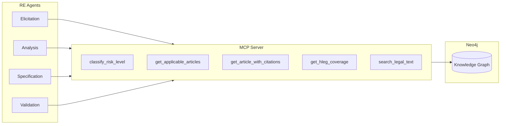

# TERE4AI MCP Server API Reference

**Version:** 0.1.0 (MVP)
**Protocol:** Model Context Protocol (MCP)
**Framework:** FastMCP

---

## Overview

The TERE4AI MCP Server provides **5 semantic tools** that bridge the Requirements Engineering agents with the Neo4j knowledge graph. Instead of agents writing raw Cypher queries, they call high-level semantic operations that return structured, validated data.



---

## Server Configuration

```python
# Environment Variables
NEO4J_URI = "neo4j://localhost:7687"
NEO4J_USER = "neo4j"
NEO4J_PASSWORD = "<your_password>"  # Required

# Server Initialization
from fastmcp import FastMCP

mcp = FastMCP(
    name="tere4ai",
    instructions="TERE4AI Knowledge Graph Server - EU AI Act and HLEG requirements"
)
```

---

## Tool Reference

### 1. `classify_risk_level`

**Purpose:** Determine the risk level of an AI system based on its features.

**When Used:** Analysis Agent calls this tool after receiving the structured `SystemDescription` from Elicitation.

```python
@mcp.tool()
def classify_risk_level(system_features: Dict[str, Any]) -> Dict[str, Any]:
    """
    Classify the risk level of an AI system based on its features.

    Checks in order:
    1. Article 5 prohibited practices → UNACCEPTABLE
    2. Annex III high-risk categories → HIGH (unless Art 6(3) exception)
    3. Article 50 transparency requirements → LIMITED
    4. Otherwise → MINIMAL
    """
```

**Input Parameters:**

| Parameter | Type | Required | Description |
|-----------|------|----------|-------------|
| `system_features` | `Dict[str, Any]` | Yes | System characteristics dictionary |

**System Features Dictionary:**

| Field | Type | Description |
|-------|------|-------------|
| `domain` | `str` | System domain (healthcare, education, employment, etc.) |
| `purpose` | `str` | What the system does |
| `raw_description` | `str` | Original user description |
| `biometric_processing` | `bool` | Processes biometric data |
| `real_time_biometric` | `bool` | Real-time biometric identification |
| `law_enforcement_use` | `bool` | Used by/for law enforcement |
| `safety_critical` | `bool` | Safety-critical application |
| `social_scoring` | `bool` | Evaluates people based on social behavior |
| `subliminal_techniques` | `bool` | Uses subliminal manipulation |
| `emotion_recognition` | `bool` | Infers emotional states |
| `affects_fundamental_rights` | `bool` | Impacts fundamental rights |
| `critical_infrastructure` | `bool` | Part of critical infrastructure |
| `deployment_context` | `str` | Where/how deployed |
| `autonomy_level` | `str` | full/partial/advisory |

**Output:**

```python
{
    "risk_level": "unacceptable" | "high" | "limited" | "minimal",
    "legal_basis_article": str,       # e.g., "5(1)(c)" or "Article 6(2) + Annex III, Section 5(a)"
    "legal_basis_text": str,          # Quoted text from source
    "annex_category": str | None,     # Annex III category if high-risk
    "article_6_exception": bool,      # Whether Art 6(3) exception applied
    "hleg_principles": List[str],     # Relevant HLEG principle IDs
    "reasoning": str                  # Explanation of classification
}
```

**Example:**

```python
# Input
system_features = {
    "domain": "healthcare",
    "purpose": "hospital triage",
    "safety_critical": True,
    "biometric_processing": False
}

# Output
{
    "risk_level": "high",
    "legal_basis_article": "Article 6(2) + Annex III, Section 5(a)",
    "legal_basis_text": "AI systems intended to be used for triage...",
    "annex_category": "5",
    "article_6_exception": False,
    "hleg_principles": [
        "technical_robustness_and_safety",
        "privacy_and_data_governance",
        "human_agency_and_oversight",
        "accountability"
    ],
    "reasoning": "System is intended for use in healthcare as a safety component..."
}
```

---

### 2. `get_applicable_articles`

**Purpose:** Get all EU AI Act articles applicable to a given risk level.

**When Used:** Analysis Agent retrieves the list of applicable articles after risk classification.

```python
@mcp.tool()
def get_applicable_articles(
    risk_level: str,
    annex_category: Optional[str] = None
) -> List[Dict[str, Any]]:
    """
    Get all applicable EU AI Act articles for a given risk level.

    HIGH risk: Articles 8-27 (Chapter III requirements)
    LIMITED risk: Article 50 (transparency)
    MINIMAL/UNACCEPTABLE: Empty list
    """
```

**Input Parameters:**

| Parameter | Type | Required | Description |
|-----------|------|----------|-------------|
| `risk_level` | `str` | Yes | "high", "limited", "minimal", or "unacceptable" |
| `annex_category` | `str` | No | Annex III category for context |

**Output:**

```python
List[{
    "number": int,           # Article number
    "title": str,            # Article title
    "section": str,          # Section name (e.g., "Chapter III, Section 2 - Requirements")
    "paragraphs": List[{
        "index": int,
        "text": str
    }],
    "category": str          # Requirement category
}]
```

**Categories:**

| Article Range | Category |
|---------------|----------|
| 8 | `general_requirements` |
| 9 | `risk_management` |
| 10 | `data_governance` |
| 11 | `documentation` |
| 12 | `record_keeping` |
| 13 | `transparency` |
| 14 | `human_oversight` |
| 15 | `accuracy_robustness` |
| 16-22 | `provider_obligations` |
| 23 | `importer_obligations` |
| 24 | `distributor_obligations` |
| 25 | `product_integration` |
| 26-27 | `deployer_obligations` |
| 50 | `transparency_limited` |

---

### 3. `get_article_with_citations`

**Purpose:** Get complete article content with supporting recitals and HLEG mappings.

**When Used:** Specification Agent calls this for each applicable article to generate requirements with full citations.

```python
@mcp.tool()
def get_article_with_citations(article_number: int) -> Dict[str, Any]:
    """
    Get complete article content with supporting recitals and HLEG mappings.

    This is the main tool for generating requirements - it provides everything
    needed to create a requirement anchored to this article.
    """
```

**Input Parameters:**

| Parameter | Type | Required | Description |
|-----------|------|----------|-------------|
| `article_number` | `int` | Yes | Article number (e.g., 9 for Article 9) |

**Output:**

```python
{
    "number": int,
    "title": str,
    "full_text": str,                  # All paragraphs combined
    "paragraphs": List[{
        "index": int,
        "text": str,
        "points": List[{
            "marker": str,             # e.g., "(a)", "(b)"
            "text": str
        }]
    }],
    "recitals": List[{
        "number": int,
        "text": str                    # Truncated to 500 chars
    }],
    "hleg_mappings": List[{
        "requirement_id": str,         # e.g., "technical_robustness_and_safety"
        "requirement_name": str,       # Human-readable name
        "relevance": float,            # 0.0-1.0 relevance score
        "rationale": str,              # Why this mapping exists
        "subtopics": List[str]         # Related subtopics
    }],
    "section": str,
    "category": str
}
```

**Example:**

```python
# Input
article_number = 9

# Output
{
    "number": 9,
    "title": "Risk management system",
    "full_text": "1. A risk management system shall be established...",
    "paragraphs": [
        {
            "index": 1,
            "text": "A risk management system shall be established, implemented, documented and maintained...",
            "points": []
        },
        {
            "index": 2,
            "text": "The risk management system shall be a continuous iterative process...",
            "points": [
                {"marker": "(a)", "text": "identification and analysis of the known and reasonably foreseeable risks..."},
                {"marker": "(b)", "text": "estimation and evaluation of the risks..."}
            ]
        }
    ],
    "recitals": [
        {"number": 47, "text": "To address the technical aspects of how to measure the appropriate levels of accuracy and robustness..."}
    ],
    "hleg_mappings": [
        {
            "requirement_id": "technical_robustness_and_safety",
            "requirement_name": "Technical Robustness and Safety",
            "relevance": 0.95,
            "rationale": "Risk management directly supports technical robustness",
            "subtopics": ["Resilience to attack and security", "Accuracy", "Reliability"]
        },
        {
            "requirement_id": "accountability",
            "requirement_name": "Accountability",
            "relevance": 0.82,
            "rationale": "Risk documentation supports auditability",
            "subtopics": ["Auditability"]
        }
    ],
    "section": "Chapter III, Section 2 - Requirements for high-risk AI systems",
    "category": "risk_management"
}
```

---

### 4. `get_hleg_coverage`

**Purpose:** Get HLEG coverage matrix for a set of articles.

**When Used:** Validation Agent checks which HLEG principles and subtopics are covered by the generated requirements.

```python
@mcp.tool()
def get_hleg_coverage(articles: List[int]) -> Dict[str, Any]:
    """
    Get HLEG coverage matrix for a set of articles.

    Shows which HLEG principles and subtopics are addressed by
    the given articles, with relevance scores.
    """
```

**Input Parameters:**

| Parameter | Type | Required | Description |
|-----------|------|----------|-------------|
| `articles` | `List[int]` | Yes | List of article numbers to analyze |

**Output:**

```python
{
    "principles": {
        "<requirement_id>": {
            "name": str,               # Human-readable name
            "max_relevance": float,    # Highest relevance score
            "articles": List[int],     # Articles that map to this principle
            "subtopics": List[str]     # Covered subtopics
        }
    },
    "coverage_percentage": float,      # % of 7 principles covered (0-100)
    "uncovered_principles": List[str], # Principle IDs not covered
    "total_mappings": int              # Total mapping count
}
```

**HLEG Principles:**

| ID | Name |
|----|------|
| `human_agency_and_oversight` | Human Agency and Oversight |
| `technical_robustness_and_safety` | Technical Robustness and Safety |
| `privacy_and_data_governance` | Privacy and Data Governance |
| `transparency` | Transparency |
| `diversity_non_discrimination_and_fairness` | Diversity, Non-discrimination and Fairness |
| `societal_and_environmental_wellbeing` | Societal and Environmental Well-being |
| `accountability` | Accountability |

---

### 5. `search_legal_text`

**Purpose:** Search across EU AI Act articles, recitals, annexes, and HLEG requirements.

**When Used:** Any agent can use this for ad-hoc queries to find relevant legal text.

```python
@mcp.tool()
def search_legal_text(
    query: str,
    filters: Optional[Dict[str, Any]] = None
) -> Dict[str, Any]:
    """
    Search across EU AI Act articles, recitals, annexes, and HLEG requirements.

    Performs keyword-based search with optional filters.
    """
```

**Input Parameters:**

| Parameter | Type | Required | Description |
|-----------|------|----------|-------------|
| `query` | `str` | Yes | Search query string |
| `filters` | `Dict` | No | Optional search filters |

**Filter Options:**

| Filter | Type | Description |
|--------|------|-------------|
| `source` | `str` | "eu_ai_act", "hleg", or "all" (default) |
| `article_range` | `List[int, int]` | Range of articles to search (e.g., [8, 15]) |
| `chapter` | `str` | Chapter number (e.g., "III") |
| `limit` | `int` | Max results (default: 10) |

**Output:**

```python
{
    "results": List[{
        "type": "article" | "recital" | "hleg",
        "reference": str,              # e.g., "Article 9(1)" or "Recital (47)"
        "text": str,                   # Truncated to 300 chars
        "article_number": int,         # If type == "article"
        "recital_number": int,         # If type == "recital"
        "requirement_id": str          # If type == "hleg"
    }],
    "total_matches": int,
    "query": str                       # Echoed back
}
```

---

## Error Handling

All tools return structured errors when they fail:

```python
{
    "error": str,  # Error message
    # ... partial results if available
}
```

**Common Errors:**
- Database connection failure
- Invalid article number
- Empty query string
- Malformed filters

---

## Usage from Agents

Agents access MCP tools through the `MCPToolClient` wrapper:

```python
from agents.base import MCPToolClient

mcp = MCPToolClient()

# Classify risk level
result = mcp.classify_risk_level(system_features)

# Get applicable articles
articles = mcp.get_applicable_articles("high", annex_category="5")

# Get article with citations
article_bundle = mcp.get_article_with_citations(9)

# Get HLEG coverage
coverage = mcp.get_hleg_coverage([8, 9, 10, 11, 12, 13, 14, 15])

# Search legal text
search_results = mcp.search_legal_text("risk management", {"source": "eu_ai_act"})
```

The `MCPToolClient` also maintains a call log for tracing:

```python
# Get all tool calls made during this session
call_log = mcp.get_call_log()

# Clear the log
mcp.clear_call_log()
```

---

## Running the Server

```bash
# As MCP server (for external clients)
python -m tere4ai.mcp_server.server

# Or import for direct use
from tere4ai.mcp_server.server import mcp
```

---

*Document created: January 2026*
*Project: TERE4AI - Trustworthy Ethical Requirements Engineering for AI*
